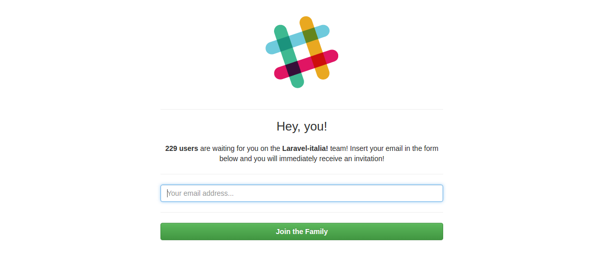

# Slacky

_An easy-to-install, Lumen based invitation tool for your Slack team._

You can use it in a "standalone" mode, or include it with a really simple widget.

* [Installation](#installation)
* [Widget](#widget)

## Installation

The keyword for this little project is "easy". All you will need to do is to execute:

    git clone https://github.com/francescomalatesta/slacky YourFolder
    cd YourFolder
    ./install

and nothing more.

If you have already added a Slack access token to your `.env` file, there's nothing more to do. 

Otherwise, you will be asked for it.

**Important:** if you don't know what an access token is, just generate it [on this page](https://api.slack.com/docs/oauth-test-tokens).

The setup script will also ask you for the tool locale. Currently supported locales:

* en
* it

You can easily change the locale whenever you want by running the `artisan slacky-setup` command.

## Widget

You can also include Slacky as a widget by including, on your site, the `widget.js` file this way:

    

So, assuming that your Slacky install is at myslacky.com, you will need to use

    

... and nothing more! The `widget.js` file will automatically create an iframe and put it on your page, wherever you prefer.
